# Architecture Diagrams

> Visual reference for every pipeline, data flow, and architectural decision in the system.

---

## Table of Contents

1. [System Architecture Overview](#1-system-architecture-overview)
2. [Module Dependency Graph](#2-module-dependency-graph)
3. [HTTP Request Lifecycle](#3-http-request-lifecycle)
4. [HAR Analysis Pipeline (5 Steps)](#4-har-analysis-pipeline)
5. [7-Layer Filtering Pipeline](#5-7-layer-filtering-pipeline)
6. [Deduplication & Grouping Engine](#6-deduplication--grouping-engine)
7. [Token Optimization Funnel](#7-token-optimization-funnel)
8. [LLM Integration (Index-Return Pattern)](#8-llm-integration-index-return-pattern)
9. [Curl Generation & Execution Cycle](#9-curl-generation--execution-cycle)
10. [SSRF Protection Pipeline](#10-ssrf-protection-pipeline)
11. [Rate Limiting Architecture](#11-rate-limiting-architecture)
12. [Error Handling & Exception Filter](#12-error-handling--exception-filter)
13. [Frontend Component Architecture](#13-frontend-component-architecture)
14. [Security Threat Model](#14-security-threat-model)
15. [Test Pyramid](#15-test-pyramid)
16. [Data Transformation Pipeline](#16-data-transformation-pipeline)
17. [Caching Strategy (Future)](#17-caching-strategy)
18. [HAR Capture & Test Flow](#18-har-capture--test-flow)

---

## 1. System Architecture Overview

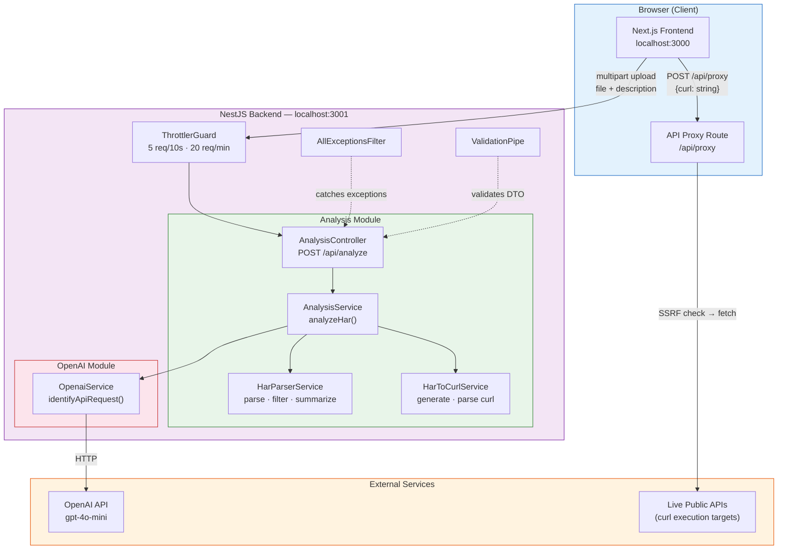

---

## 2. Module Dependency Graph

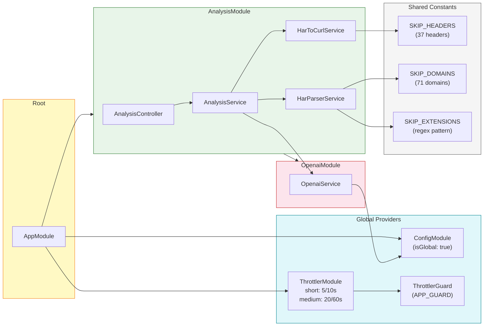

---

## 3. HTTP Request Lifecycle

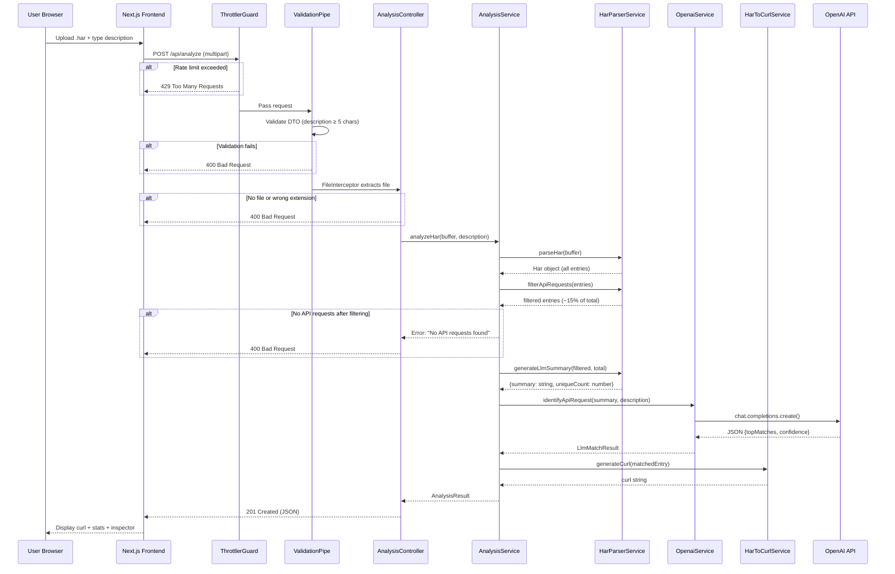

---

## 4. HAR Analysis Pipeline

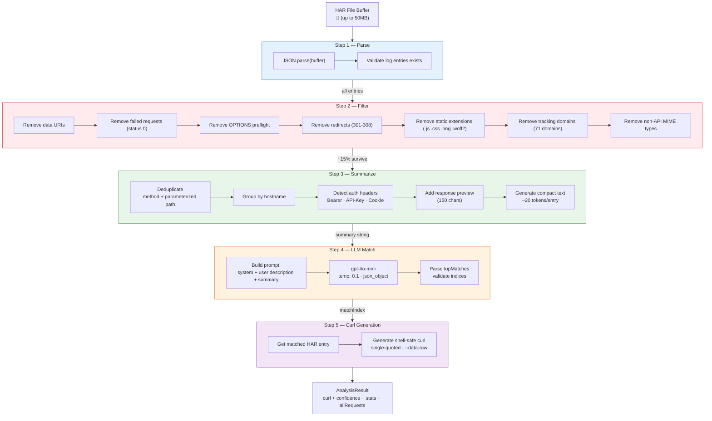

---

## 5. 7-Layer Filtering Pipeline

```mermaid
graph LR
    In["All HAR Entries<br/>100%"] --> L1

    L1["Layer 1<br/>Data URIs &<br/>Empty URLs"] -->|"~99%"| L2
    L2["Layer 2<br/>Failed Requests<br/>status === 0"] -->|"~95%"| L3
    L3["Layer 3<br/>OPTIONS &<br/>Redirects<br/>301-308"] -->|"~85%"| L4
    L4["Layer 4<br/>Static Extensions<br/>.js .css .png<br/>.woff2 .svg .map"] -->|"~40%"| L5
    L5["Layer 5<br/>Tracking Domains<br/>71 blocked<br/>google-analytics<br/>facebook · hotjar"] -->|"~30%"| L6
    L6["Layer 6<br/>Non-API MIME<br/>text/html<br/>application/javascript<br/>image/* · font/*<br/>audio/* · video/*"] -->|"~18%"| L7
    L7["Layer 7<br/>Conservative Keep<br/>unknown types ✓<br/>4xx/5xx errors ✓<br/>octet-stream ✓"] --> Out

    Out["API Candidates<br/>~10-20%"]

    style In fill:#ffcdd2,stroke:#b71c1c
    style L1 fill:#ffcdd2,stroke:#c62828
    style L2 fill:#ffcdd2,stroke:#c62828
    style L3 fill:#ffe0b2,stroke:#e65100
    style L4 fill:#fff9c4,stroke:#f57f17
    style L5 fill:#dcedc8,stroke:#558b2f
    style L6 fill:#c8e6c9,stroke:#2e7d32
    style L7 fill:#b2dfdb,stroke:#00695c
    style Out fill:#e8f5e9,stroke:#1b5e20
```

### Filtering Examples (Real HAR Files)

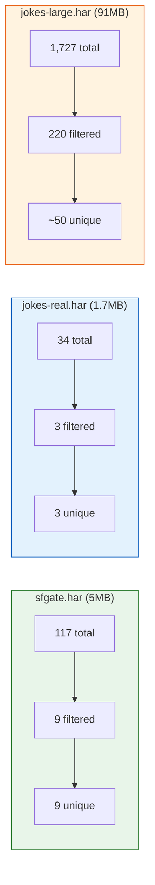

---

## 6. Deduplication & Grouping Engine

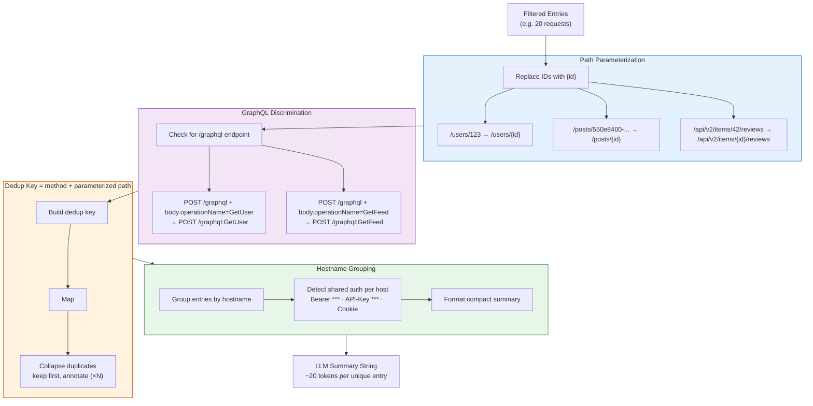

### Example Output

```
=== HAR Analysis: 5 unique API requests (12 total, duplicates collapsed) from 200 raw entries ===

[api.weather.com] (2 requests, Auth: Bearer ***)
  0. GET /v3/wx/forecast?geocode=37.77,-122.42 → 200 json (2.0KB)
     Preview: {"temperature":72,"humidity":65,"condition":"partly cloudy"...
  1. GET /v3/wx/conditions → 200 json (800B)  (×3)

[api.example.com] (3 requests, Auth: Bearer ***)
  2. POST /graphql:GetUser → 200 json body: {"operationName":"GetUser"...
  3. GET /api/v2/users/{id} → 200 json (4.5KB)  (×4)
  4. POST /graphql:GetFeed → 200 json body: {"operationName":"GetFeed"...
```

---

## 7. Token Optimization Funnel

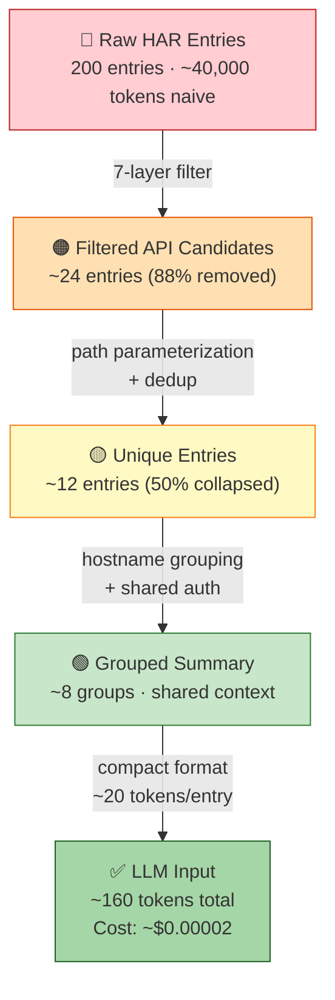

### Cost at Each Stage

| Stage | Entries | Tokens (est.) | Cost (gpt-4o-mini) |
|-------|---------|---------------|---------------------|
| Raw (naive) | 200 | ~40,000 | ~$0.006 |
| After filter | 24 | ~4,800 | ~$0.0007 |
| After dedup | 12 | ~2,400 | ~$0.0004 |
| After grouping | 12 | ~240 | ~$0.00004 |
| **Final (with format)** | **12** | **~160** | **~$0.00002** |

**Total savings: 99.6% token reduction**

---

## 8. LLM Integration (Index-Return Pattern)

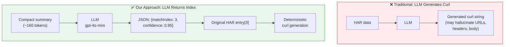

### LLM Prompt Structure

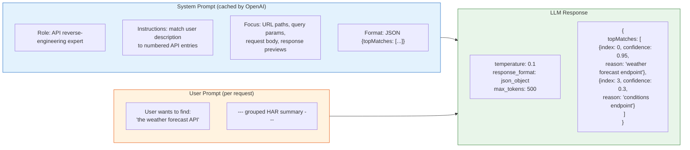

---

## 9. Curl Generation & Execution Cycle

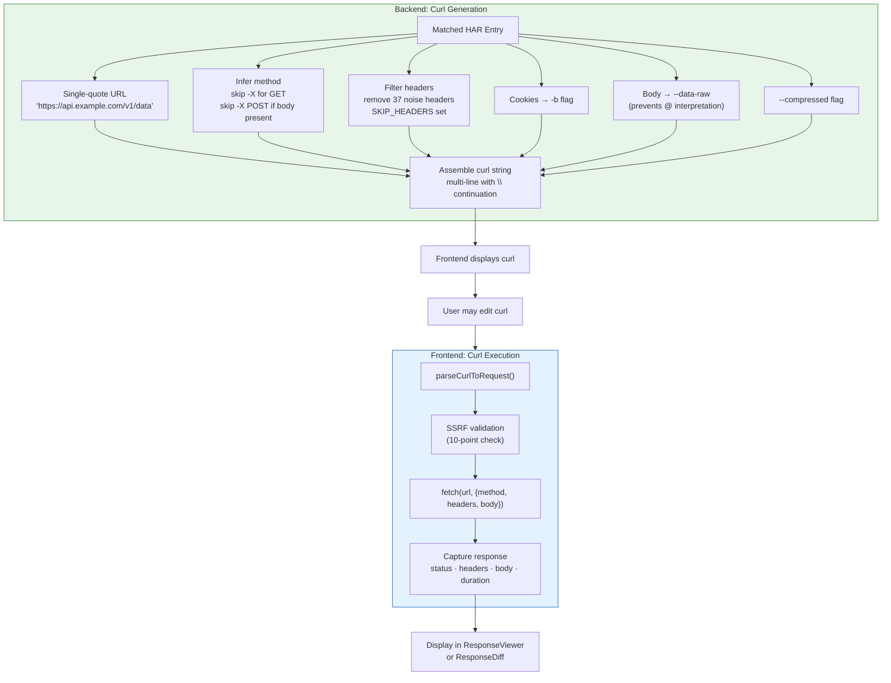

### Header Classification

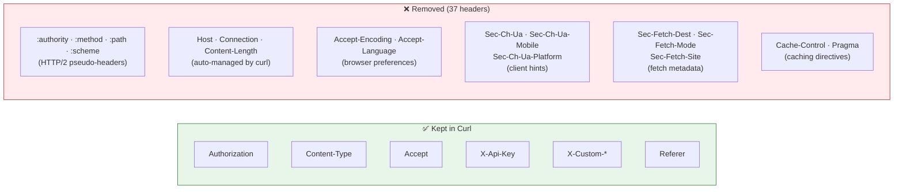

---

## 10. SSRF Protection Pipeline

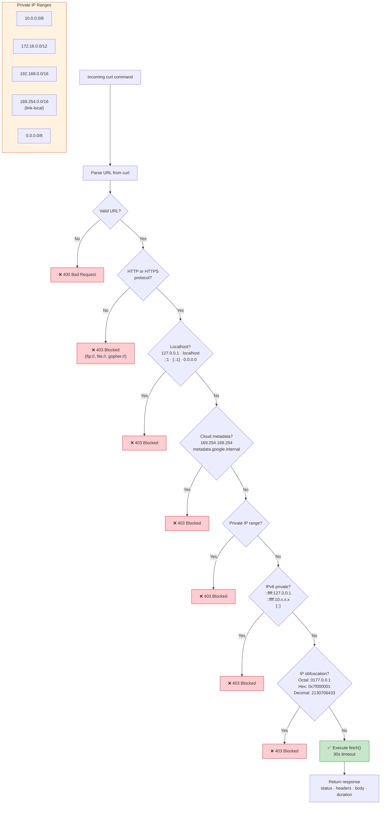

### Known Limitation: DNS Rebinding

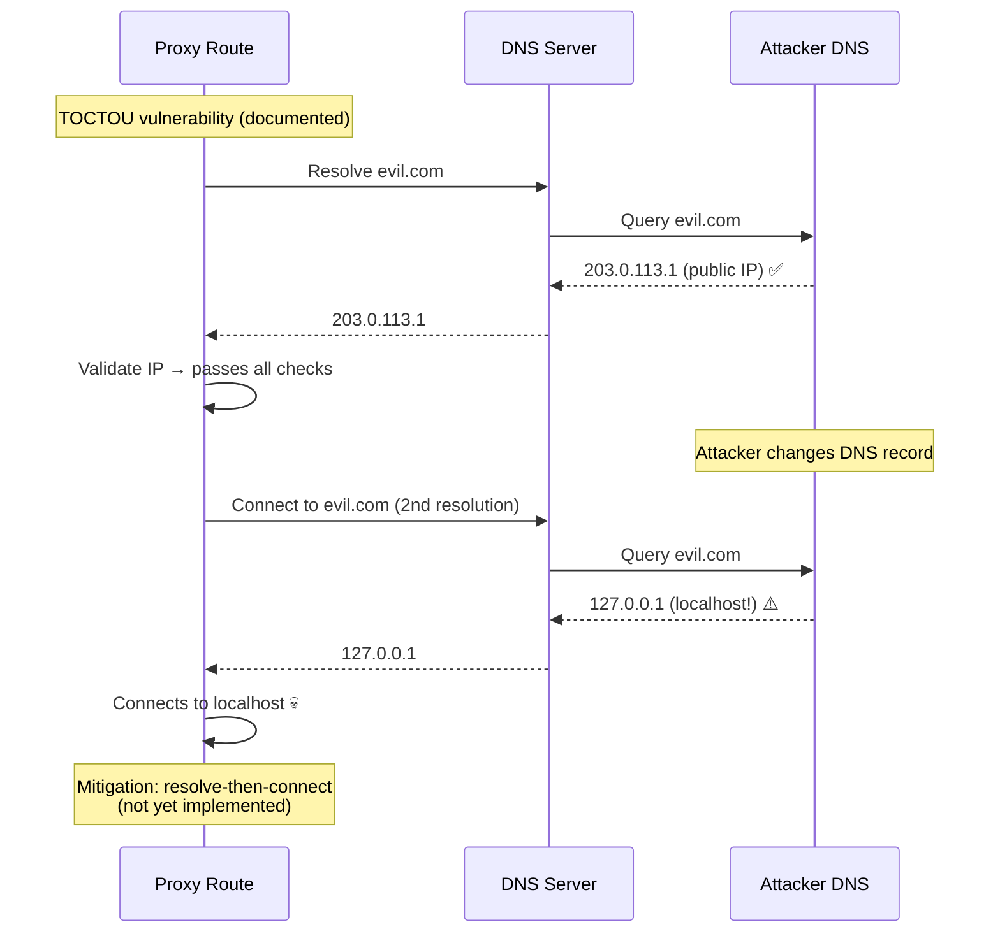

---

## 11. Rate Limiting Architecture

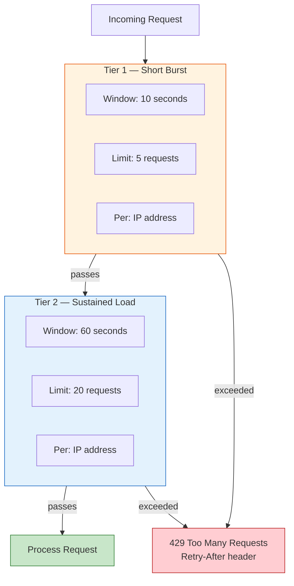

### Window Boundary Burst Problem

```mermaid
gantt
    title Fixed Window Rate Limiting — Boundary Burst
    dateFormat X
    axisFormat %s

    section Window 1 (0-10s)
    5 requests at t=8-10s     :a1, 8, 10

    section Window 2 (10-20s)
    5 requests at t=10-12s    :a2, 10, 12

    section Actual Impact
    10 requests in 4 seconds! :crit, a3, 8, 12
```

> NestJS Throttler uses fixed windows. The burst at window boundaries means up to 2x the limit can occur in a short period. This is acceptable for our use case (API calls cost ~$0.001 each).

---

## 12. Error Handling & Exception Filter

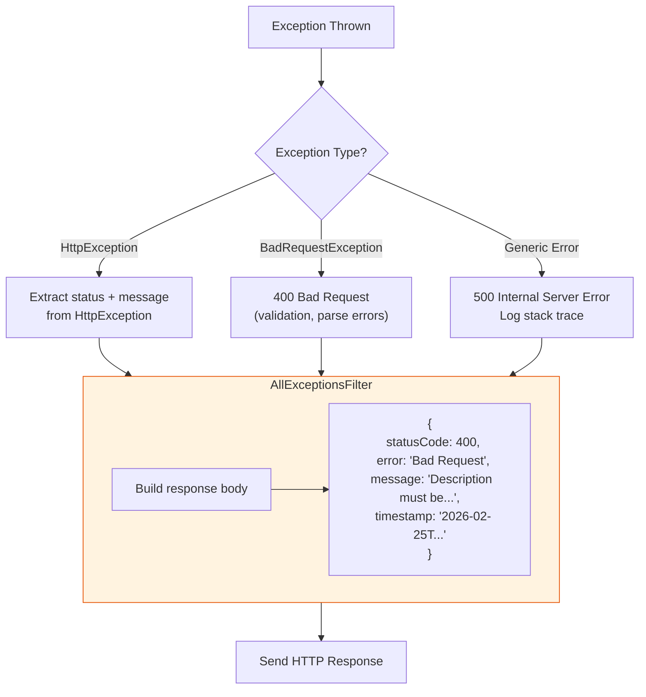

### Error Taxonomy

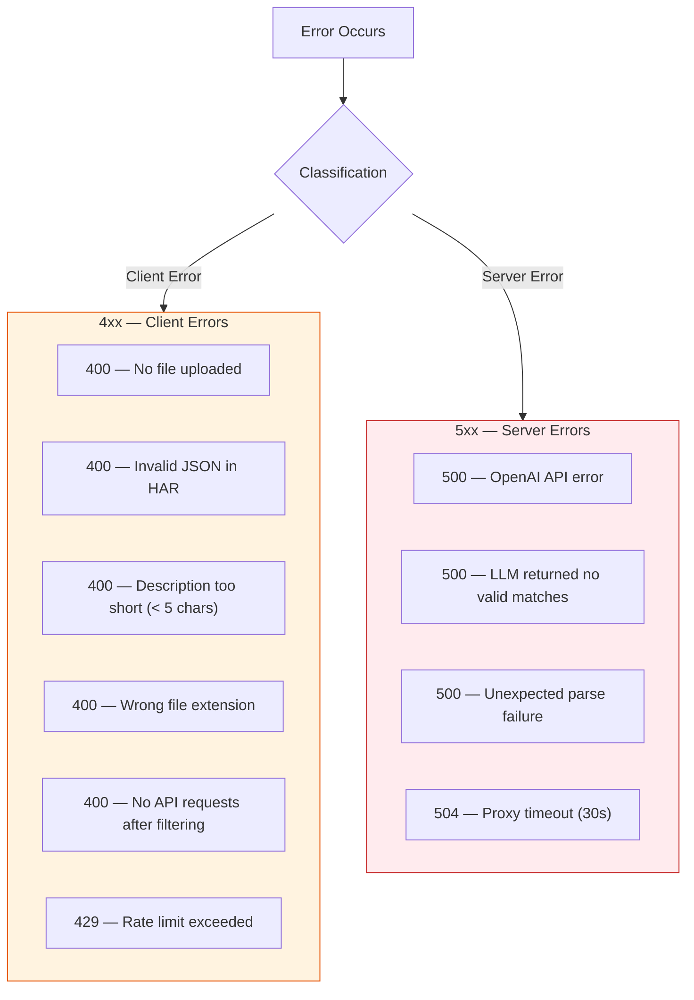

---

## 13. Frontend Component Architecture

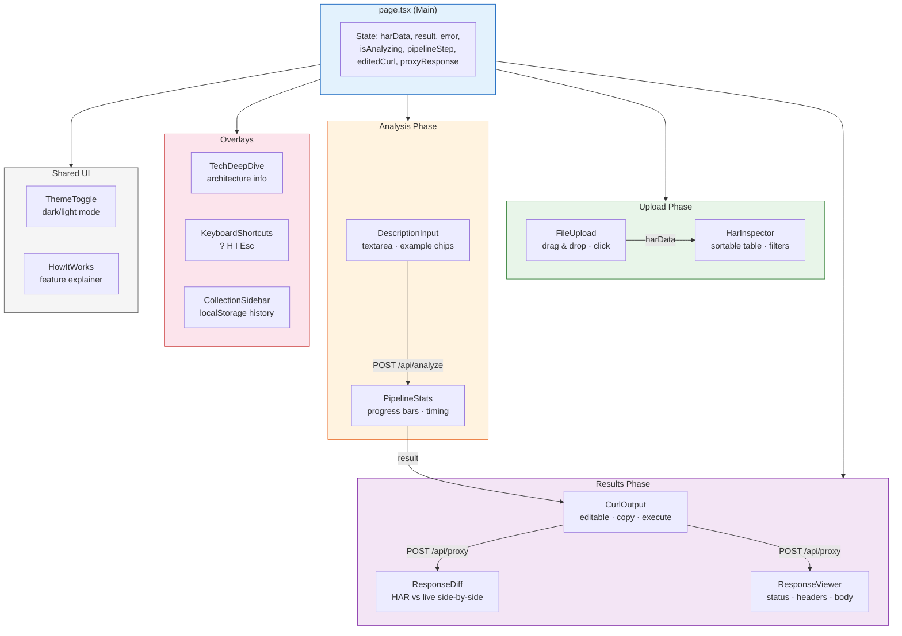

### User Interaction Flow

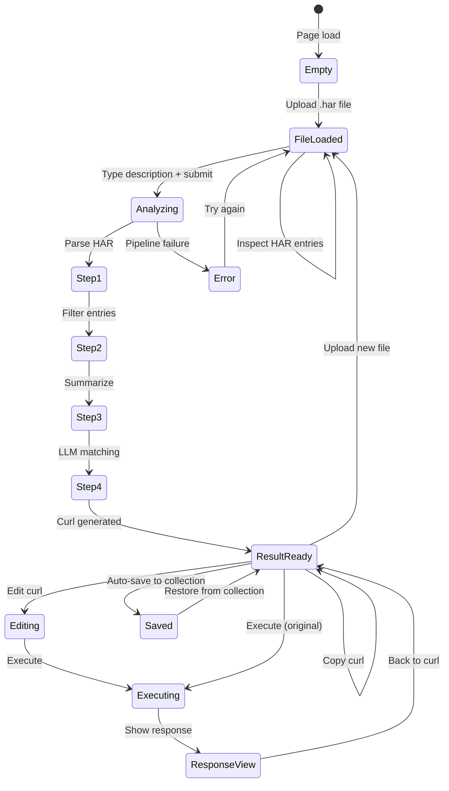

---

## 14. Security Threat Model

```mermaid
graph TD
    subgraph Threats["Threat Vectors"]
        T1["🔴 SSRF via curl execution<br/>Access internal services"]
        T2["🔴 Shell injection via curl<br/>Execute arbitrary commands"]
        T3["🟠 API key exposure<br/>Leak OpenAI key to client"]
        T4["🟠 Sensitive data in HAR<br/>Auth tokens, cookies, PII"]
        T5["🟡 Rate limit abuse<br/>DDoS or cost exhaustion"]
        T6["🟡 Large file DoS<br/>Memory exhaustion"]
        T7["🟡 XSS via response display<br/>Malicious API response content"]
    end

    subgraph Mitigations["Mitigations"]
        M1["10-point IP blocklist<br/>+ protocol validation<br/>+ 30s timeout"]
        M2["Single-quote shell escaping<br/>--data-raw (no @ interp)<br/>Deterministic generation"]
        M3["Key stays on backend<br/>never sent to frontend<br/>env-only config"]
        M4["Memory-only file handling<br/>files never written to disk<br/>buffer discarded after use"]
        M5["Two-tier throttle<br/>5/10s + 20/60s<br/>per-IP tracking"]
        M6["50MB upload limit<br/>Multer memory storage<br/>streaming for large files"]
        M7["React auto-escaping<br/>CSP headers<br/>Content-Type validation"]
    end

    T1 --> M1
    T2 --> M2
    T3 --> M3
    T4 --> M4
    T5 --> M5
    T6 --> M6
    T7 --> M7

    style Threats fill:#ffebee,stroke:#c62828
    style Mitigations fill:#e8f5e9,stroke:#2e7d32
```

---

## 15. Test Pyramid

```mermaid
graph TD
    subgraph Pyramid["Test Pyramid — 334 Tests"]
        L1["🔺 Stress Tests (12)<br/>Concurrent · Large files · Edge cases<br/>e2e-stress.spec.ts"]
        L2["🔺 HTTP E2E (10)<br/>Multipart upload through NestJS<br/>e2e-http.spec.ts"]
        L3["🔺 Pipeline E2E (15)<br/>Full analyzeHar() + curl execution<br/>e2e-pipeline.spec.ts"]
        L4["🔺 Live API E2E (57)<br/>Build HAR → LLM → execute curl<br/>e2e-live.spec.ts + e2e-live-expanded.spec.ts"]
        L5["🔺 Real-World Eval (5)<br/>Assignment HARs + execution<br/>eval-real-world.spec.ts"]
        L6["🔺 Synthetic Eval (63)<br/>10 categories · 4 difficulties<br/>eval.spec.ts"]
        L7["🔺 Unit Tests (192)<br/>Parser · Curl · Service · Controller · SSRF · Perf<br/>7 spec files"]
    end

    L1 --- L2
    L2 --- L3
    L3 --- L4
    L4 --- L5
    L5 --- L6
    L6 --- L7

    style L1 fill:#ffcdd2,stroke:#b71c1c
    style L2 fill:#ffe0b2,stroke:#e65100
    style L3 fill:#fff9c4,stroke:#f57f17
    style L4 fill:#dcedc8,stroke:#558b2f
    style L5 fill:#c8e6c9,stroke:#2e7d32
    style L6 fill:#b2dfdb,stroke:#00695c
    style L7 fill:#b3e5fc,stroke:#0277bd
```

### Test Coverage Across Pipeline Stages

```mermaid
graph LR
    subgraph Stage["Pipeline Stage"]
        P["Parse"] --> F["Filter"] --> D["Dedup"] --> S["Summarize"] --> L["LLM"] --> C["Curl Gen"] --> E["Execute"]
    end

    subgraph Coverage["Test Coverage"]
        P1["Unit: 48 tests<br/>har-parser.spec"] -.-> P
        P1 -.-> F
        P2["Unit: 35 tests<br/>har-to-curl.spec"] -.-> C
        P3["Unit: 8 tests<br/>analysis.service.spec"] -.-> P
        P3 -.-> F
        P3 -.-> D
        P3 -.-> S
        P4["Eval: 63 tests<br/>eval.spec"] -.-> L
        P5["Pipeline: 15 tests<br/>e2e-pipeline.spec"] -.-> P
        P5 -.-> F
        P5 -.-> D
        P5 -.-> S
        P5 -.-> L
        P5 -.-> C
        P5 -.-> E
        P6["HTTP: 10 tests<br/>e2e-http.spec"] -.-> P
        P6 -.-> E
        P7["Live: 57 tests<br/>e2e-live*.spec"] -.-> L
        P7 -.-> C
        P7 -.-> E
    end

    style Stage fill:#e3f2fd,stroke:#1565c0
    style Coverage fill:#f5f5f5,stroke:#9e9e9e
```

---

## 16. Data Transformation Pipeline

Traces a single HAR entry through every transformation stage:

```mermaid
graph TD
    subgraph Raw["1. Raw HAR Entry"]
        R1["request:<br/>  method: GET<br/>  url: https://api.weather.com/v3/wx/forecast?geocode=37.77,-122.42&format=json<br/>  headers: [Accept: application/json, Authorization: Bearer sk-abc123...,<br/>    Sec-Fetch-Mode: cors, :authority: api.weather.com, ...]<br/>  cookies: [session=xyz]<br/>response:<br/>  status: 200<br/>  content: {mimeType: application/json, size: 2048}<br/>  body: {temperature: 72, humidity: 65, ...}<br/>time: 245"]
    end

    Raw -->|"filterApiRequests()"| Filtered

    subgraph Filtered["2. Survives Filtering"]
        F1["✅ Not a static extension<br/>✅ Not a tracking domain<br/>✅ application/json MIME type<br/>✅ Status 200 (not redirect/failed)<br/>✅ Not OPTIONS preflight"]
    end

    Filtered -->|"parameterizePath()"| Parameterized

    subgraph Parameterized["3. Path Parameterized"]
        P1["URL stays same (no numeric IDs in path)<br/>Dedup key: GET /v3/wx/forecast"]
    end

    Parameterized -->|"generateLlmSummary()"| Summary

    subgraph Summary["4. LLM Summary Line"]
        S1["[api.weather.com] (1 request, Auth: Bearer ***)<br/>  0. GET /v3/wx/forecast?geocode=37.77,-122.42&format=json → 200 json (2.0KB)<br/>     Preview: {&quot;temperature&quot;:72,&quot;humidity&quot;:65,&quot;condition&quot;:&quot;partly cloudy&quot;..."]
    end

    Summary -->|"LLM returns index 0"| Matched

    subgraph Matched["5. LLM Match"]
        M1["matchIndex: 0<br/>confidence: 0.95<br/>reason: 'Weather forecast endpoint with geocode parameters'"]
    end

    Matched -->|"generateCurl()"| Curl

    subgraph Curl["6. Generated Curl"]
        C1["curl 'https://api.weather.com/v3/wx/forecast?geocode=37.77,-122.42&format=json' \<br/>  -H 'Accept: application/json' \<br/>  -H 'Authorization: Bearer sk-abc123...' \<br/>  -b 'session=xyz' \<br/>  --compressed"]
    end

    Curl -->|"execute via proxy"| Executed

    subgraph Executed["7. Live Execution"]
        E1["HTTP 200 OK<br/>{temperature: 68, humidity: 71, condition: 'sunny'}<br/>Duration: 312ms"]
    end

    style Raw fill:#ffebee,stroke:#c62828
    style Filtered fill:#fff3e0,stroke:#e65100
    style Parameterized fill:#fff9c4,stroke:#f57f17
    style Summary fill:#e8f5e9,stroke:#2e7d32
    style Matched fill:#e3f2fd,stroke:#1565c0
    style Curl fill:#f3e5f5,stroke:#7b1fa2
    style Executed fill:#e0f2f1,stroke:#00695c
```

---

## 17. Caching Strategy

> Not yet implemented — documented as future architecture.

```mermaid
graph TD
    Request["analyzeHar(buffer, description)"] --> L1

    subgraph L1["Layer 1: Exact Match Cache"]
        Hash["SHA-256(harHash + description + model)"]
        Lookup["In-memory Map lookup"]
        Hash --> Lookup
    end

    L1 -->|"HIT"| Return["Return cached result<br/>(skip all processing)"]
    L1 -->|"MISS"| L2

    subgraph L2["Layer 2: Semantic Cache (future)"]
        Embed["Embed description → vector"]
        Cosine["Cosine similarity search<br/>threshold: 0.95"]
        Embed --> Cosine
    end

    L2 -->|"HIT"| Return
    L2 -->|"MISS"| L3

    subgraph L3["Layer 3: OpenAI Prompt Cache"]
        Prefix["System prompt (identical across requests)<br/>→ cached by OpenAI automatically"]
        Note["50% discount on cached input tokens<br/>128-token chunk granularity"]
        Prefix --> Note
    end

    L3 --> LLM["Full LLM call<br/>gpt-4o-mini"]
    LLM --> Store["Store result in L1 cache<br/>TTL: 1 hour"]
    Store --> Return

    style L1 fill:#e8f5e9,stroke:#2e7d32
    style L2 fill:#e3f2fd,stroke:#1565c0
    style L3 fill:#fff3e0,stroke:#e65100
```

---

## 18. HAR Capture & Test Flow

```mermaid
graph TD
    subgraph Capture["Playwright HAR Capture"]
        Sites["6 Target Sites<br/>Open-Meteo · USGS · PokeAPI<br/>HN · Dog CEO · JSONPlaceholder"]
        Browser["chromium.launch({headless: true})"]
        Record["context.recordHar({path, mode: 'full'})"]
        Navigate["page.goto(url, {waitUntil: 'networkidle'})"]
        Interact["Custom interactions<br/>(click buttons, fetch APIs)"]
        Close["context.close() → flush HAR"]
        Sites --> Browser --> Record --> Navigate --> Interact --> Close
    end

    Close --> Files["test-fixtures/captured/*.har<br/>(gitignored)"]

    subgraph Pipeline["Pipeline Tests (e2e-pipeline.spec.ts)"]
        Read["Read .har as Buffer"]
        Analyze["service.analyzeHar(buffer, description)"]
        Assert["Assert: correct URL, method, confidence"]
        Execute["Execute curl via fetch()"]
        Verify["Verify: HTTP 200, expected body shape"]
        Read --> Analyze --> Assert --> Execute --> Verify
    end

    subgraph HTTP["HTTP Tests (e2e-http.spec.ts)"]
        Upload["supertest: POST /api/analyze<br/>.attach('file', harPath)<br/>.field('description', '...')"]
        Check["Assert 201 + response shape"]
        Exec2["Execute returned curl"]
        Upload --> Check --> Exec2
    end

    subgraph Stress["Stress Tests (e2e-stress.spec.ts)"]
        Concurrent["5 parallel analyzeHar() calls"]
        Large["87MB HAR file"]
        Rapid["5 rapid sequential uploads"]
        Edge["Edge: empty, static-only, unicode"]
        Consistent["3x same input → same output"]
    end

    Files --> Pipeline
    Files --> HTTP
    Files --> Stress

    style Capture fill:#e3f2fd,stroke:#1565c0
    style Pipeline fill:#e8f5e9,stroke:#2e7d32
    style HTTP fill:#fff3e0,stroke:#e65100
    style Stress fill:#f3e5f5,stroke:#7b1fa2
```
